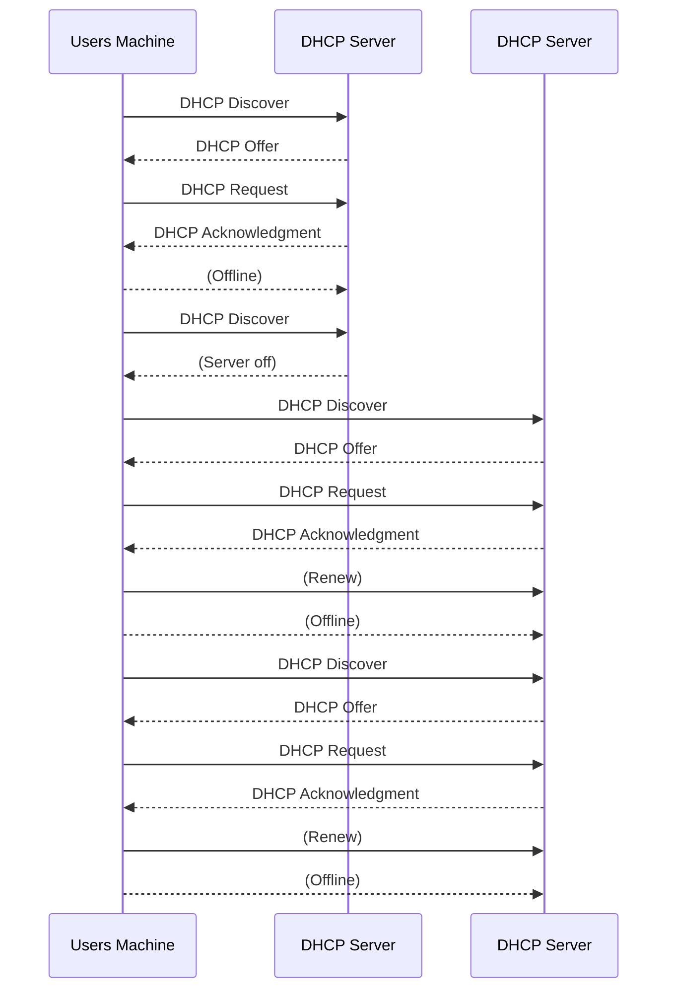

# DHCPdiagram

```mermaid
sequenceDiagram
    participant User as Users Machine
    participant Server1 as DHCP Server #1
    participant Server2 as DHCP Server #2

    User->>Server1: DHCP Discover
    Server1-->>User: DHCP Offer 

    User->>Server1: DHCP Request 
    Server1-->>User: DHCP Acknowledgment 

    User-->>Server1: (Offline)

    User->>Server1: DHCP Discover
    Server1-->>User: (Server off)

    User->>Server2: DHCP Discover
    Server2-->>User: DHCP Offer 
    User->>Server2: DHCP Request 
    Server2-->>User: DHCP Acknowledgment 

    User->>Server2: (Renew)

    User-->>Server2: (Offline)

    User->>Server2: DHCP Discover
    Server2-->>User: DHCP Offer
    User->>Server2: DHCP Request
    Server2-->>User: DHCP Acknowledgment

    User->>Server2: (Renew)

    User-->>Server2: (Offline)
```
