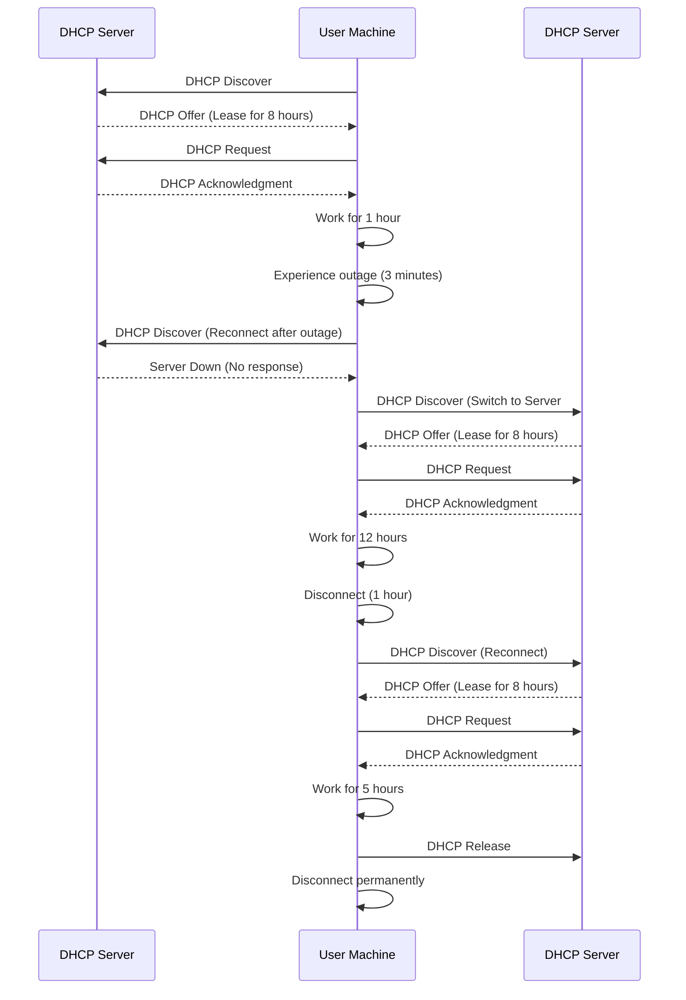

# DHCPdiagram

```mermaid
sequenceDiagram
    participant Server1 as DHCP Server #1
    participant User as User Machine
    participant Server2 as DHCP Server #2

    User->>Server1: DHCP Discover
    Server1-->>User: DHCP Offer (Lease for 8 hours)
    User->>Server1: DHCP Request
    Server1-->>User: DHCP Acknowledgment

    User->>User: Work for 1 hour

    User->>User: Experience outage (3 minutes)
    User->>Server1: DHCP Discover (Reconnect after outage)
    Server1-->>User: Server Down (No response)
    User->>Server2: DHCP Discover (Switch to Server #2)
    Server2-->>User: DHCP Offer (Lease for 8 hours)
    User->>Server2: DHCP Request
    Server2-->>User: DHCP Acknowledgment

    User->>User: Work for 12 hours

    User->>User: Disconnect (1 hour)
    
    User->>Server2: DHCP Discover (Reconnect)
    Server2-->>User: DHCP Offer (Lease for 8 hours)
    User->>Server2: DHCP Request
    Server2-->>User: DHCP Acknowledgment

    User->>User: Work for 5 hours
    User->>Server2: DHCP Release
    User->>User: Disconnect permanently

```
